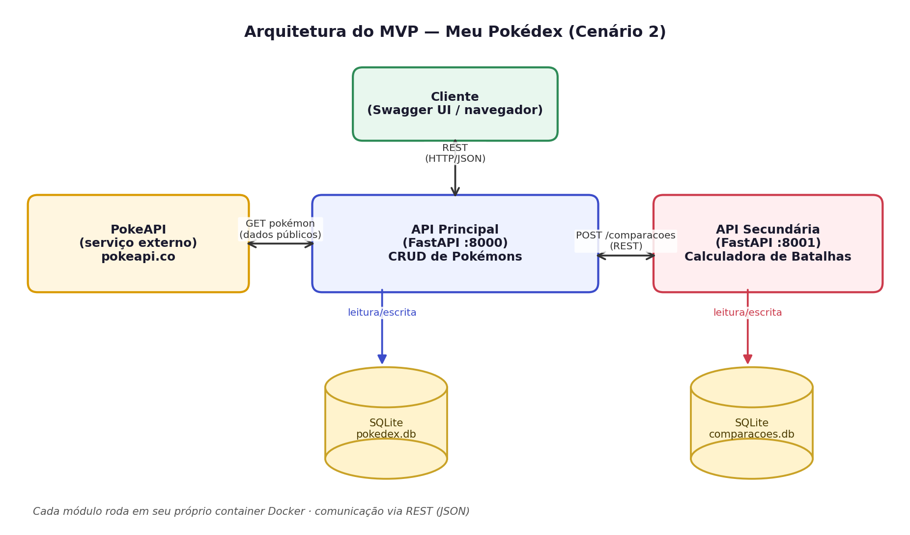

# Pokédex Collection API

API REST desenvolvida em **Python (FastAPI)** que gerencia uma coleção pessoal
de Pokémons. Ao cadastrar um Pokémon, seus dados (tipos e status base) são
buscados automaticamente na **PokeAPI** (serviço externo). Esta API também se
comunica com a [**Pokédex Battle API**](https://github.com/Botegaa/pokedex-battle-api)
para calcular, entre dois Pokémons da sua coleção, quem provavelmente
venceria uma batalha, com base na efetividade de tipos.

Este repositório é o módulo **API Principal** de um MVP de Componentização e
Arquitetura de Software, seguindo o **Cenário 2**: *API principal consulta um
serviço externo e se comunica com uma API secundária*.

## Arquitetura



- **Pokédex Collection API** (este repositório): CRUD da coleção de
  Pokémons, consome a PokeAPI e delega o cálculo de batalhas à API de
  batalhas.
- **[Pokédex Battle API](https://github.com/Botegaa/pokedex-battle-api)**:
  recebe dois Pokémons e calcula a efetividade de tipos entre eles
  (repositório separado).
- **PokeAPI**: serviço externo público usado para obter os dados de cada
  Pokémon.
- Persistência: **SQLite** (arquivo `data/pokedex.db`, criado
  automaticamente).

## Serviço externo utilizado

- **Nome:** [PokeAPI](https://pokeapi.co/)
- **Licença/custo:** serviço público e gratuito, sem necessidade de API key
  ou cadastro (uso justo/fair use conforme a documentação oficial).
- **Rota consumida:** `GET https://pokeapi.co/api/v2/pokemon/{nome}`
- Os dados retornados (tipos e status base) são **tratados e persistidos**
  na nossa própria base SQLite — o usuário nunca é redirecionado à PokeAPI.

## Rotas da API

| Método | Rota                    | Descrição                                                              |
|--------|--------------------------|-------------------------------------------------------------------------|
| POST   | `/pokemons`              | Busca um Pokémon na PokeAPI pelo nome e adiciona à coleção             |
| GET    | `/pokemons`               | Lista os Pokémons salvos (com filtro por tipo, ordenação e paginação)  |
| GET    | `/pokemons/{id}`          | Detalha um Pokémon da coleção                                          |
| PUT    | `/pokemons/{id}`          | Atualiza apelido e/ou anotações de um Pokémon                          |
| DELETE | `/pokemons/{id}`          | Remove um Pokémon da coleção                                           |
| POST   | `/pokemons/comparar`      | Compara dois Pokémons da coleção via Pokédex Battle API                |

### Funcionalidades extras (criatividade)

- Filtro por tipo: `GET /pokemons?tipo=electric`
- Ordenação: `GET /pokemons?ordenar_por=velocidade&ordem=desc`
- Paginação: `GET /pokemons?pagina=2&tamanho_pagina=5`
- Domínio próprio (coleção de Pokémons + calculadora de batalhas), diferente
  dos exemplos apresentados em aula.

### Exemplo de uso

```bash
curl -X POST http://localhost:8000/pokemons \
  -H "Content-Type: application/json" \
  -d '{"nome": "pikachu", "apelido": "Pikas"}'
```

## Como executar

### Opção 1 — Docker Compose (recomendado, sobe as duas APIs juntas)

> Pré-requisito: clone o repositório
> [pokedex-battle-api](https://github.com/Botegaa/pokedex-battle-api) como
> pasta **irmã** desta, pois o `docker-compose.yml` referencia
> `../pokedex-battle-api`.

```
pasta-do-projeto/
├── pokedex-collection-api/     (este repositório)
└── pokedex-battle-api/
```

```bash
cd pokedex-collection-api
docker compose up --build
```

- API Principal: http://localhost:8000/docs
- API de Batalhas: http://localhost:8001/docs

### Opção 2 — Apenas este container (Battle API já rodando em outro lugar)

```bash
docker build -t pokedex-collection-api .
docker run -p 8000:8000 \
  -e API_SECUNDARIA_URL=http://localhost:8001 \
  pokedex-collection-api
```

### Opção 3 — Localmente, sem Docker

```bash
python -m venv venv
source venv/bin/activate        # Windows: venv\Scripts\activate
pip install -r requirements.txt
export API_SECUNDARIA_URL=http://localhost:8001   # Windows: set API_SECUNDARIA_URL=...
uvicorn app.main:app --reload --port 8000
```

Depois de iniciar, acesse a documentação interativa (Swagger) em:
**http://localhost:8000/docs**

## Estrutura do projeto

```
pokedex-collection-api/
├── app/
│   ├── main.py               # Rotas da API
│   ├── models.py             # Modelo SQLAlchemy (Pokemon)
│   ├── schemas.py            # Schemas Pydantic (validação)
│   ├── database.py           # Configuração do SQLite
│   ├── pokeapi_client.py     # Cliente da PokeAPI (serviço externo)
│   └── secundaria_client.py  # Cliente da Pokédex Battle API
├── assets/
│   └── arquitetura.png       # Diagrama de arquitetura
├── Dockerfile
├── docker-compose.yml
├── requirements.txt
└── README.md
```

## Tecnologias

- Python 3.11
- FastAPI + Uvicorn
- SQLAlchemy + SQLite
- httpx (requisições HTTP)
- Docker

## Repositório relacionado

- [pokedex-battle-api](https://github.com/Botegaa/pokedex-battle-api) — API
  secundária que calcula as batalhas.
